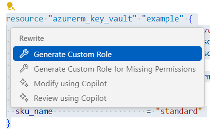

# Guide to Generating Required Permissions for AzureRM Resources

## Introduction

This guide is intended to help you generate the required permissions for AzureRM resources in your Terraform configuration.

## Prerequisites

- Terraform 1.8.0 or later

## Generation Steps

This guide will walk you through the steps to generate the required permissions for AzureRM resources in a Terraform configuration.

### Step 1: Generate a Custom Role for AzureRM Resources

For example, if the code block below is selected:

```hcl
resource "azurerm_key_vault" "example" {
  name                        = "examplekeyvault"
  location                    = azurerm_resource_group.example.location
  resource_group_name         = azurerm_resource_group.example.name
  enabled_for_disk_encryption = true
  tenant_id                   = data.azurerm_client_config.current.tenant_id
  soft_delete_retention_days  = 7
  purge_protection_enabled    = false
  sku_name                    = "standard"
}
```

After selecting the code, you will see a light bulb icon on the left side of the resource block. Click on the light bulb icon and select `Generate Custom Role`.



After clicking `Generate Custom Role`, you will see a progress bar showing the generation progress.

Below is the generated role in a new file:

```hcl
provider "azurerm" {
  features {}
}

variable "subscription_id" {
  type        = string
  description = "The UUID of the Azure Subscription where the Role Definition will be created"
  default     = "49824ffe-67ce-4765-be73-93c2ac1b55a8"
}

variable "assign_scope_id" {
  type        = string
  description = "The resource ID of the scope where the Role Definition will be assigned"
  default     = "/subscriptions/49824ffe-67ce-4765-be73-93c2ac1b55a8"
}

variable "principal_id" {
  type        = string
  description = "The ID of the Principal (User, Group or Service Principal) to assign the Role Definition to"
  default     = "6260f80a-123d-430b-aea2-59e03a2ca078"
}

resource "azurerm_role_definition" "roleb21854a0-b52c-42df-a090-1eb689b9b939" {
  name  = "CustomRole_b21854a0-b52c-42df-a090-1eb689b9b939"
  scope = "/subscriptions/${var.subscription_id}"

  permissions {
    actions = [
      "Microsoft.KeyVault/locations/deletedVaults/purge/action",
      "Microsoft.KeyVault/locations/deletedVaults/read",
      "Microsoft.KeyVault/vaults/delete",
      "Microsoft.KeyVault/vaults/read",
      "Microsoft.KeyVault/vaults/write"
    ]
    data_actions     = []
    not_actions      = []
    not_data_actions = []
  }

  assignable_scopes = [
    "/subscriptions/${var.subscription_id}"
  ]
}

resource "azurerm_role_assignment" "assignmentb21854a0-b52c-42df-a090-1eb689b9b939" {
  scope              = var.assign_scope_id
  role_definition_id = azurerm_role_definition.roleb21854a0-b52c-42df-a090-1eb689b9b939.role_definition_resource_id
  principal_id       = var.principal_id
}
```

The generated code may not be perfect, you may need to update the rest of the code manually. For example, some required permissions noted in the Azure documentation might not be generated.

You can also choose the `Generate Custom Role for Missing Permission` option, which will exclude permissions already included in the existing principal. This option is useful when you want to add missing permissions to an existing target. For example, if your existing principal already has the `Microsoft.KeyVault/vaults/read` permission, you can use this option to generate a custom role that only includes the missing permissions, as shown below. If your principal already has all the necessary permissions, you will see a message saying `No missing permission`.

```hcl
resource "azurerm_role_definition" "roleb21854a0-b52c-42df-a090-1eb689b9b939" {
  name  = "CustomRole_b21854a0-b52c-42df-a090-1eb689b9b939"
  scope = "/subscriptions/${var.subscription_id}"

  permissions {
    actions = [
      "Microsoft.KeyVault/locations/deletedVaults/purge/action",
      "Microsoft.KeyVault/locations/deletedVaults/read",
      "Microsoft.KeyVault/vaults/delete",
      "Microsoft.KeyVault/vaults/write"
    ]
    data_actions     = []
    not_actions      = []
    not_data_actions = []
  }

  assignable_scopes = [
    "/subscriptions/${var.subscription_id}"
  ]
}
```

### Step 2: Apply Custom Role

To create the generated custom role, the `Microsoft.Authorization/roleDefinitions/write` permission is required. You need to use a principal that has this permission to run the `terraform apply` command. You can use the generated variables to specify the target principal to assign the role to.

## Frequently Asked Questions

### Why did the generated custom role miss some required permissions?

The generated custom role may not include all the required permissions. You can refer to the Azure documentation for the specific resource to find the missing permissions for different scenarios. The generated custom role is just a starting point, and you may need to add additional permissions manually. Besides, only control plane actions are supported for now, data plane actions are not supported.

### How long does the generation take?

The generation should take a short time (5-15 seconds, depending on network speed). Generating missing permissions might take longer because it will retrieve the existing permissions for the current principal.

### How about generation for multiple resources?

The generation supports selecting multiple resources at the same time. You can select multiple resource blocks and click on the light bulb icon to generate a role for them.
